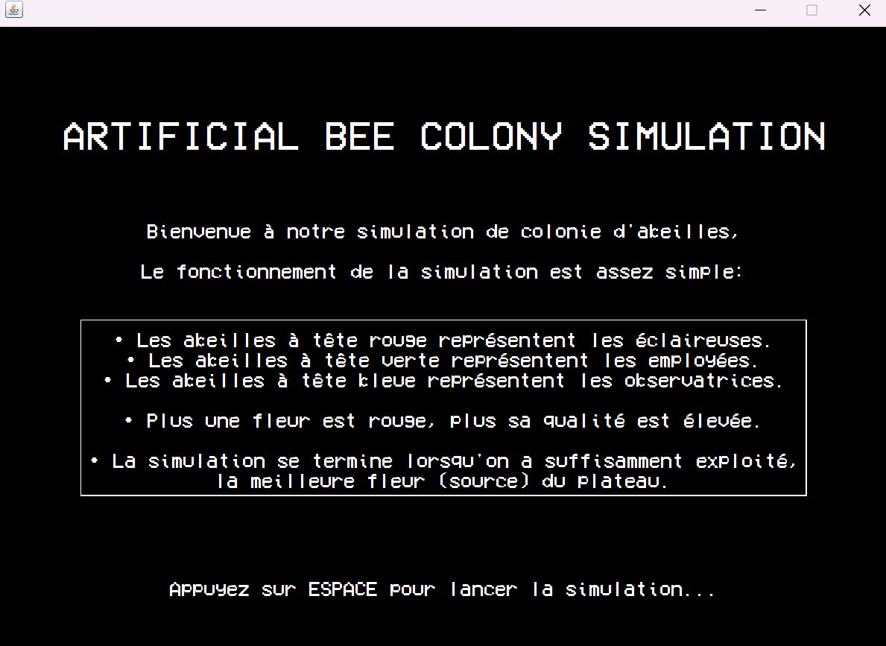
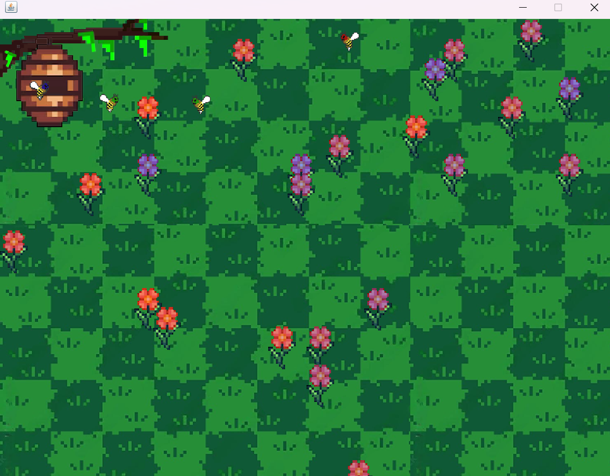
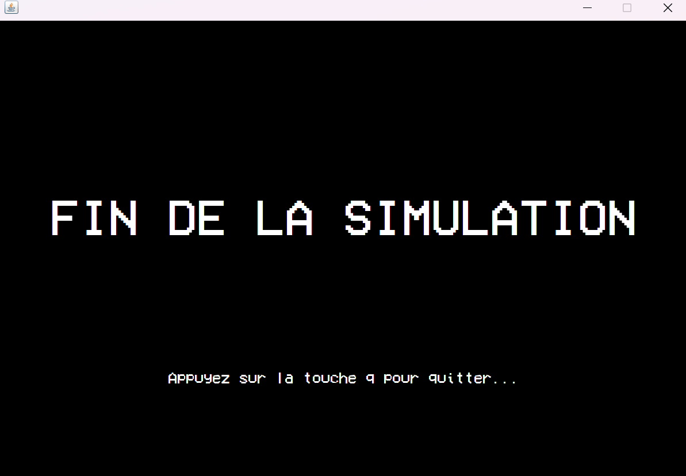

# Simulation de Colonie d'Abeilles

Ce projet simule une colonie d'abeilles avec des rôles distincts et une logique spécifique. La simulation utilise Java et crée une représentation visuelle de la colonie en suivant des règles et des comportements attribués aux différents types d'abeilles.

## Objectif du Projet

L'objectif de ce projet est de modéliser une colonie d'abeilles, où chaque type d'abeille a un rôle unique qui contribue au bon fonctionnement de la colonie. Le programme simule les interactions entre les abeilles en fonction de leur rôle.

## Aperçu





## Fonctionnalités

- **Rôles spécifiques** : Différents types d'abeilles (scouts, ouvrières, etc.) avec des comportements individualisés.
- **Simulation visuelle** : Représentation graphique des actions et de l'évolution de la colonie.
- **Logique de collaboration** : Les abeilles interagissent pour effectuer diverses tâches collectivement.
- **Utilisation des classes personnalisées** : Structure claire et modularité avec des classes pour chaque composant.

## Structure du Projet

- **`MainGame.java`** : Gère la boucle principale du jeu et initialise la simulation.
- **`Terrain.java`** : Représente le terrain sur lequel les abeilles évoluent et ce qui s'y passe.
- **`Bee.java`** : Classe de base pour les abeilles, avec les attributs et comportements généraux.
- **`Scout.java`** : Modélise le comportement des abeilles éclaireuses, chargées d'explorer les environs.
- **`Node.java`** : Représente un nœud ou fleur dans le terrain.
- **`EndScreen.java` et `TitleScreen.java`** : Gèrent respectivement les écrans de fin et de titre pour l'interface utilisateur.
- **`CustomUtils.java`** : Fournit des méthodes utilitaires pour la gestion de divers aspects du jeu.
- **`Sound.java`** : Gère les effets sonores pour améliorer l'expérience utilisateur.
- **`Observer.java`** : Implémente le modèle observateur pour surveiller et réagir aux changements dans la simulation.

## Fonctionnement de l'Algorithme

1. **Initialisation** : Le programme initialise le terrain et les entités, comme les abeilles et les nœuds d'intérêt.
2. **Actions des Abeilles** : Chaque type d'abeille exécute ses actions en fonction de son rôle. Par exemple, les scouts explorent le terrain pour repérer des ressources.
3. **Interactions** : Les abeilles interagissent avec leur environnement et entre elles, réalisant des actions collectives pour maintenir la colonie.
4. **Fin de Simulation** : La simulation se termine lorsque certaines conditions sont remplies, et l'écran de fin est affiché.

## Utilisation

### Prérequis

Assurez-vous d'avoir un environnement Java configuré pour compiler et exécuter le programme.

### Compilation

Pour compiler le projet, utilisez la commande suivante dans le répertoire du projet :
```bash
javac *.java
```

### Exécution

Pour lancer la simulation, utilisez la commande suivante :
```bash
java MainGame
```
